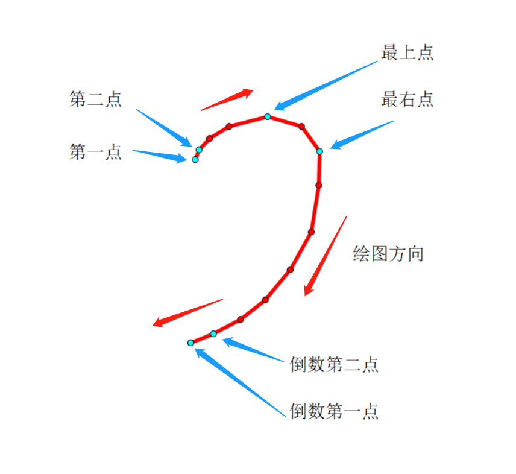
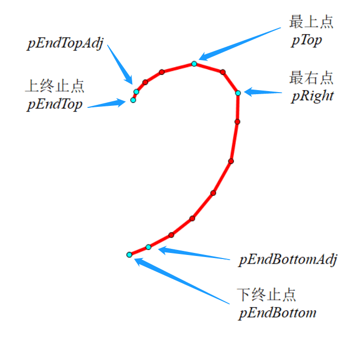

# 爱心匹配数据采集方案
### 采集前提
- 单位长度为 canvas 宽度`clientWidth`的 1/10（也可以是其他比值），保证canvas在不同设备下宽高比值一定。（例如，对高\*宽为 300px\*400px 的 canvas 的一点直接获取到的坐标为 (30px, 60px) 。当单位长度为宽度的 1/10 时，则需要将该点坐标改为 (1, 2) 。）
- 只允许用户画一笔。
- 若绘画区域在左侧，将爱心的一半转为右边的一半。
### 采集步骤
1. 在用户绘画过程中采集第一点、第二点、倒数第二点、倒数第一点、最右点、最上点的坐标。

1. 比较第一点和倒数第一点的纵坐标，从而得出上终止点和下终止点。
1. 标记：上终止点及其相邻点分别为`pEndTop`和`pEndTopAdj`、下终止点及其相邻点分别为`pEndBottom`和`pEndBottomAdj`、最上点为`pTop`、最右点为`pRight`、某个点的横坐标和纵坐标的属性名分别为`x`和`y`。

1. 进行如下计算并按照如下格式传输，数据以浮点数储存：
    ```
    points: {
        t_top: (pEndTopAdj.y - pEndTop.y) / (pEndTopAdj.x - pEndTop.x),
        t_bottom: (pEndBottomAdj.y - pEndBottom.y) / (pEndBottomAdj.x - pEndBottom.x),
        h_end_top: pEndBottom.y - pEndTop.y,
        p_top: {
            x: (pTop.x - pEndBottom.x) / (pEndBottom.y - pEndTop.y),
            y: (pTop.y - pEndBottom.y) / (pEndBottom.y - pEndTop.y)
        },
        p_right: {
            x: (pRight.x - pEndBottom.x) / (pEndBottom.y - pEndTop.y),
            y: (pRight.y - pEndBottom.y) / (pEndBottom.y - pEndTop.y)
        }
    }
    ```